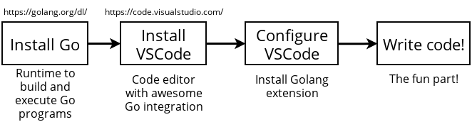

# Install & Setup



1. ติดตั้ง golang จากที่นี่ : https://golang.org/dl/
2. ทดลองสั่งรัน `go` ให้ได้
3. ติดตั้ง extension go ใน vscode จากที่นี่ : https://marketplace.visualstudio.com/items?itemName=golang.Go
4. ทดลองสั่งรัน `go run main.go` จากไฟล์ [main.go](main.go) ควรต้องได้ผลดังนี้

```
Hello world!
```