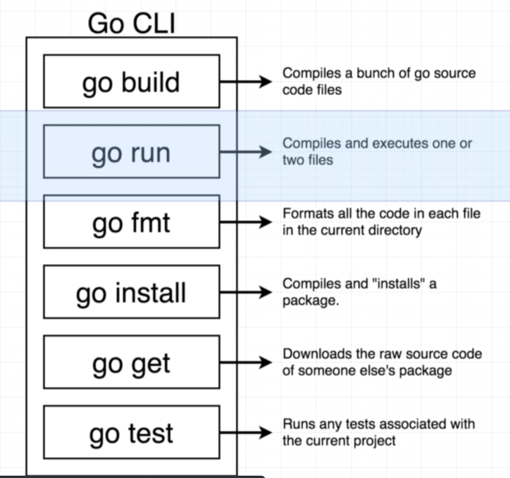
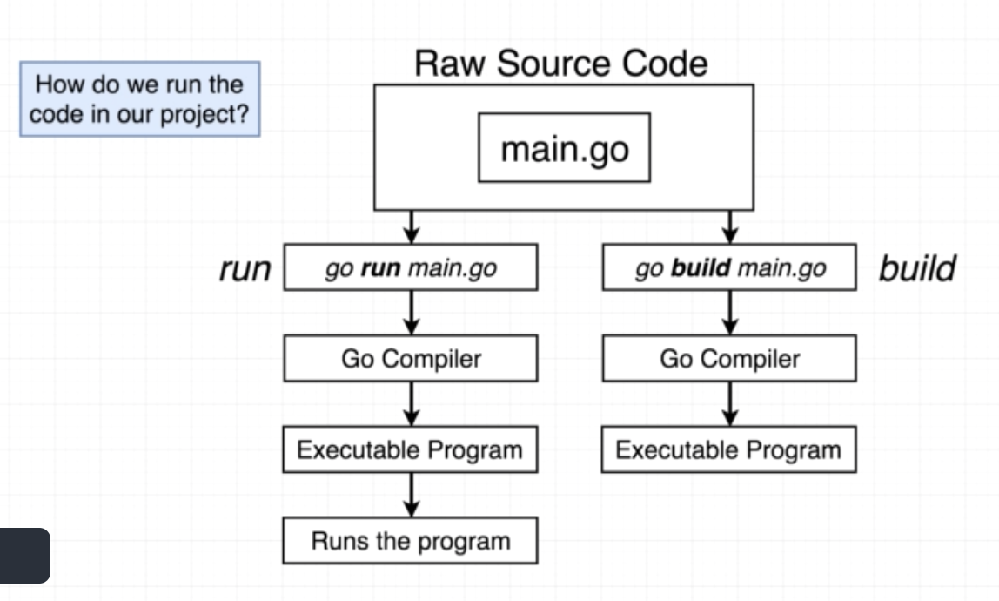
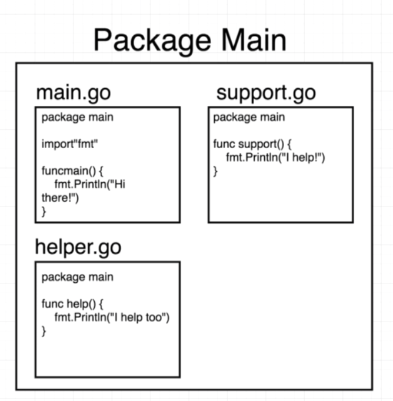
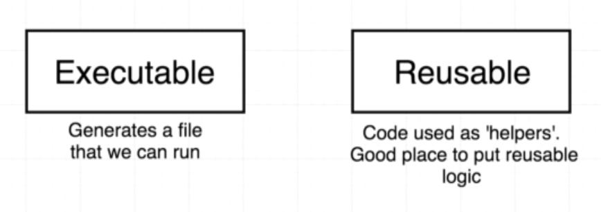
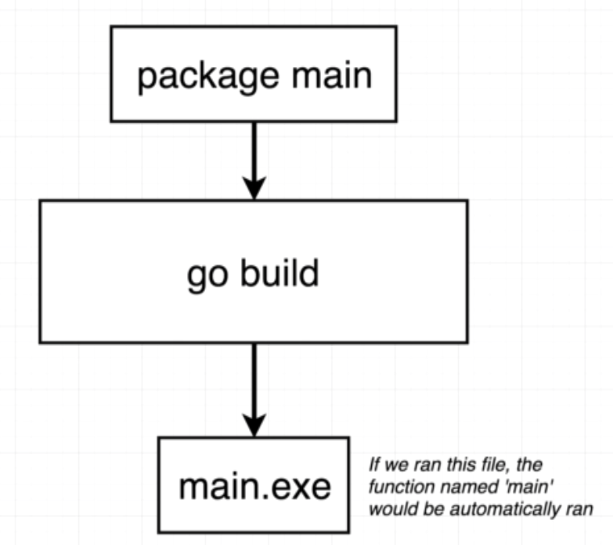
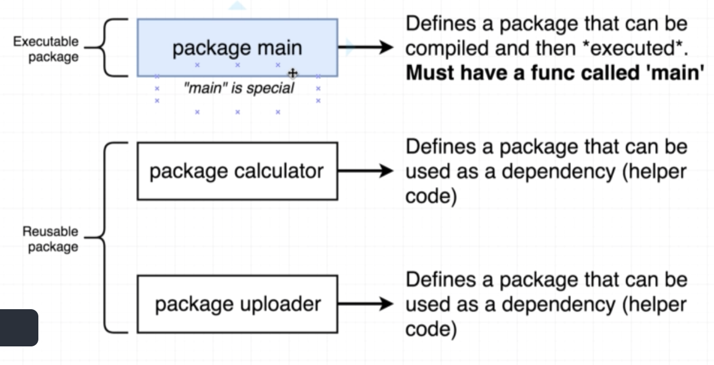
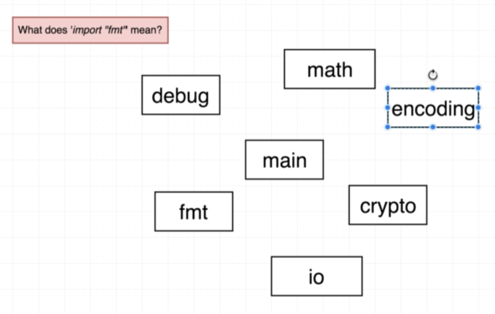
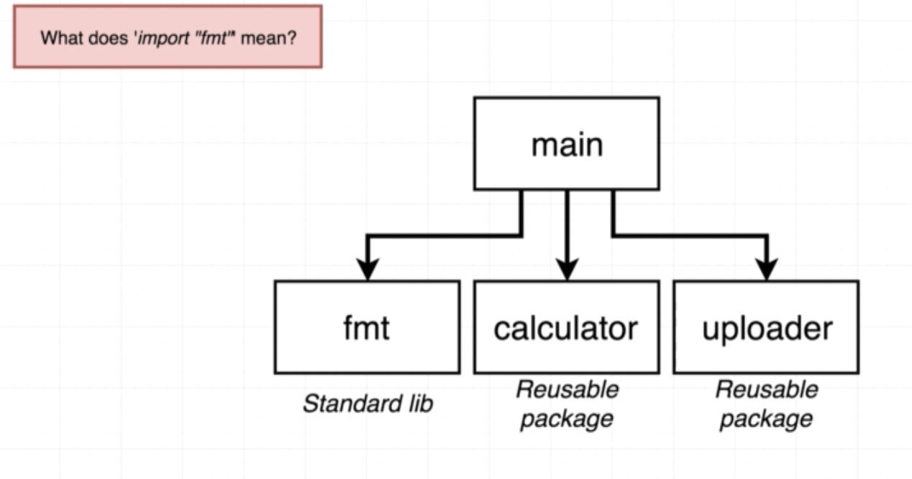

# Introduction
##  How to we run code?



```
go run main.go
```

```
go build main.go
./main
```



## `package main`?

Package == Project == Workspace

### Package?



### Type of package



### Executable



### Reuseable


### Comparision



## import "fmt"





### Standard lib

https://golang.org/pkg