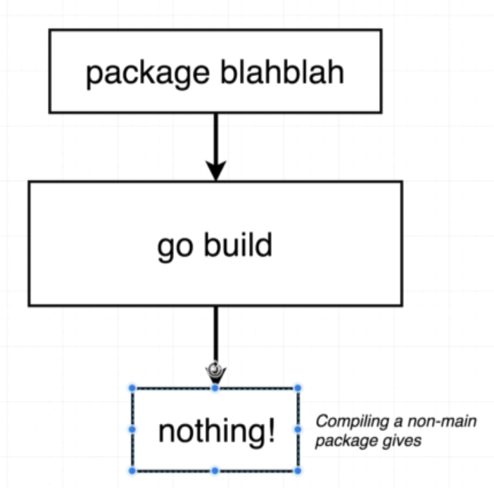

# Introduction
##  How to we run code?


```
go run main.go
```

```
go build main.go
./main
```


## `package main`?

Package == Project == Workspace

### Package?


### Type of package


### Executable


### Reuseable



### Comparision


## import "fmt"


### Standard lib

https://golang.org/pkg