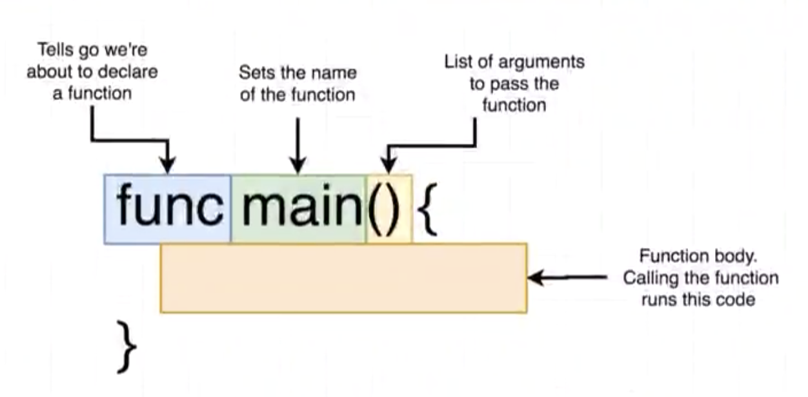
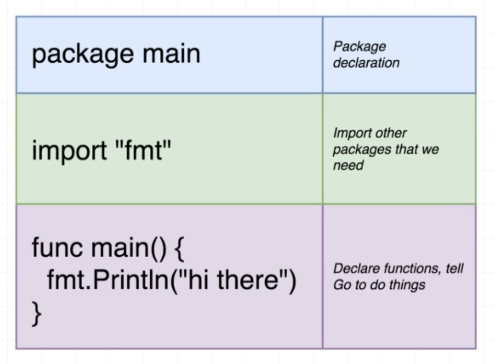

# Introduction
##  How to we run code?


```
go run main.go
```

```
go build main.go
./main
```


## `package main`?

Package == Project == Workspace

### Package?


### Type of package


### Executable


### Reuseable


### Comparision


## import "fmt"


### Standard lib

https://golang.org/pkg

## func?



## How is the main.go file organinzed?



# Quiz

1. What is the purpose of a package in Go?

```
A. To specify the load order of files
B. To group together code with a similar purpose
C. To customize your program for running on MacOS or Windows
```
<!-- B. -->

2. What is the special name we use for a package to tell Go that we want it to be turned into a file that can be executed?

```
A. fmt
B. main
C. pkg
```
<!-- B. -->

3. The one requirement of packages named "main" is that we...

```
A. Export all functions declared within it
B. Import at least one system package
C. Define a function named "main", which is ran automatically when the program runs
```
<!-- C. -->

4. Why do we use "import" statements?
```
A. To give our package access to code written in another package
B. To optimize garbage collection
C. To declare functions we that our package should optimize
```
<!-- A. -->


