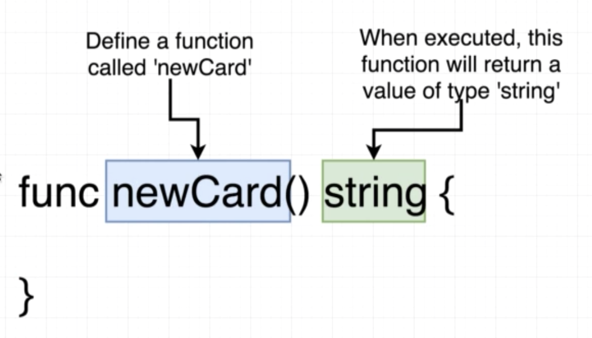

# Card project
##  Functions and Return Types



## Quiz

1. If a function returns a value, do we have to annotate, or mark, the function with the type of value that is being returned?

```
A. Yes
B. No
C. Sometimes
```

<!-- A -->

2.  What should we do to fix the error?

```go
func getSize() {
    return "30 meters"
}
```

```
A. Change the function name to 'GetSize'
B. Add a return type of 'string' to the function, like "func getSize() string {"
C. Add a return type of 'int' to the function, like "func getSize() int {"
```

<!-- B -->

3.  Is the following function valid?

```go
func estimatePi() float64 {
    return 3.14
}
```

```
A. Yes
B. No
```

<!-- A -->

4.  Is the following code valid?  Why or why not?

```go
package main
 
import "fmt"
 
func main() {
    fmt.Println(getTitle())
}
 
func getTitle() string {
    return "Harry Potter"
}
```

```
A. No, it is not valid because the 'getTitle' function is called in 'main' before it is defined
B. Yes
```

<!-- B -->

5. Is the following code valid?  Why or why not?

`main.go`

```go
package main
 
func main() {
    printState()
}
```

`state.go`

```go
package main
 
import "fmt"
 
func printState() {
    fmt.Println("California")
}
```

```
go run main.go state.go
```

```
A. No, because the 'state.go' file must be imported because it can be used.
B. Yes, because both files are apart of the same package.
```

<!-- B -->