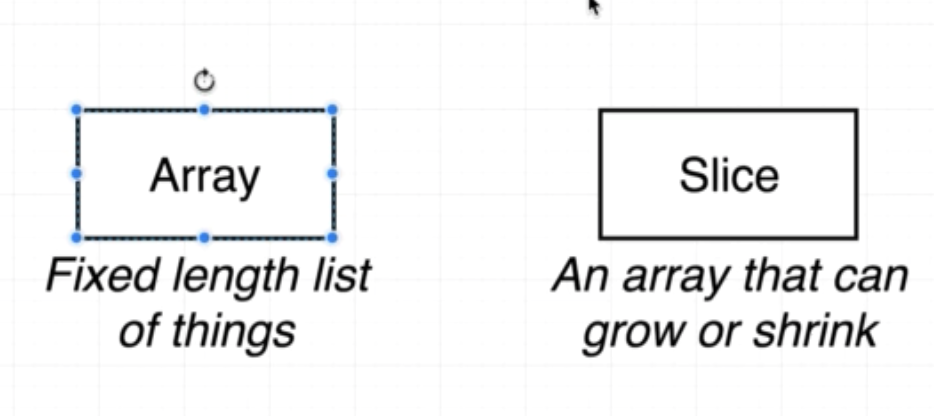
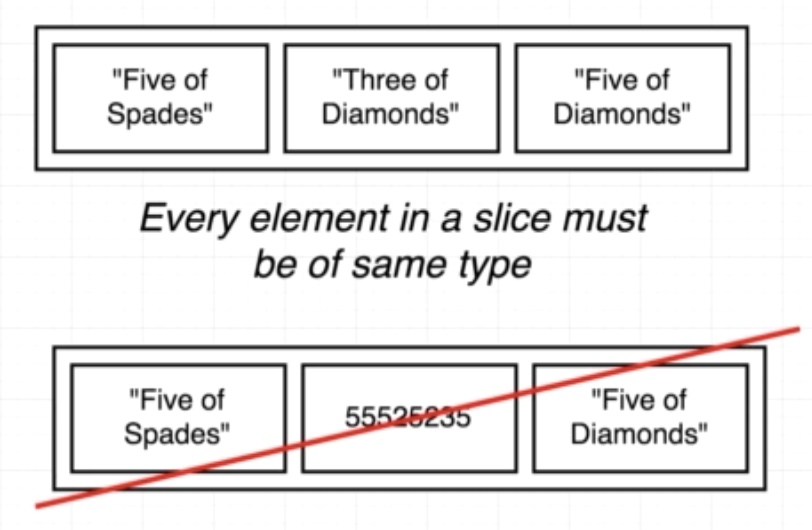
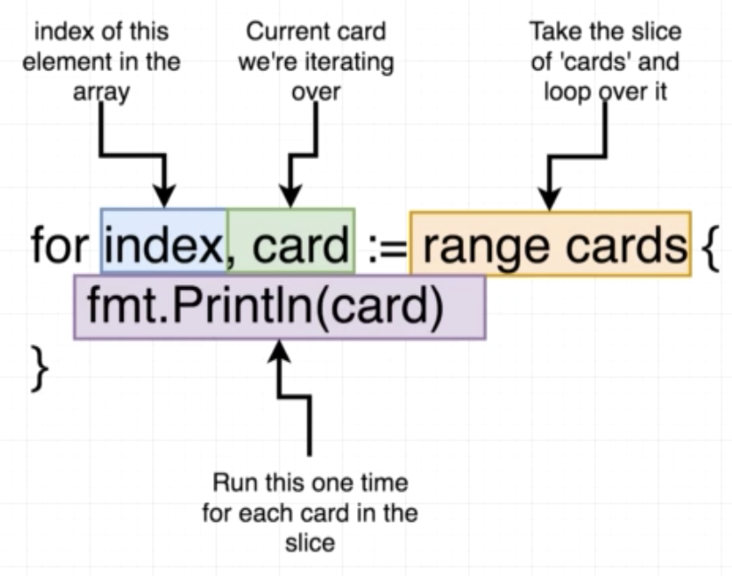

# Card project
##  Slices vs Array



## Slice's rule



## For Loop



## Quiz

1. Which of the following represents a slice where each element in it is of type int?

```
A. []string{}
B. []int{}
C. []float{}
```

<!-- B -->

2.  Is the following code valid?

```go
colors := []strings{"Red", "Yellow", "Blue"}
```

```
A. Yes
B. No, because we can't declare and assign a slice in a single line
C. No, because "strings" is not a valid type
```

<!-- C -->

3.  How do we iterate through each element in a slice and print out its value?

```go
colors := []string{"Red", "Yellow", "Blue"}
```

4.  Can a slice have both values of type 'int' and of type 'string' in it?

```
A. Yes, we can put any value into a slice
B. No, because a slice can only have one type of value in it.
```

<!-- B -->

5. Is the following code valid?

```go
for index, card := range cards {
    fmt.Println(card)
}
```

```
A. No, because every variable we declare must be used in our code.  In this case, 'index' is not being used.
B. Yes, because there are no syntax errors.
```

<!-- A -->