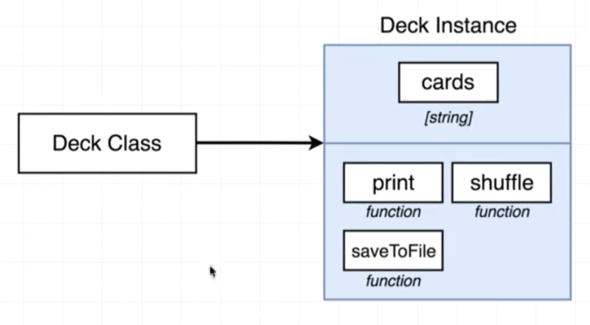
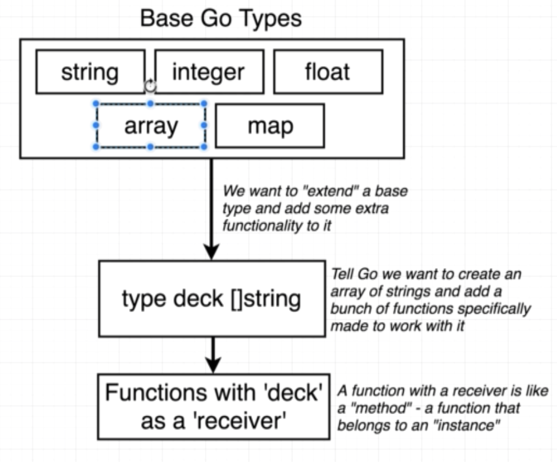
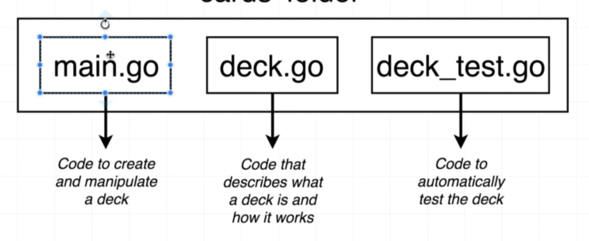
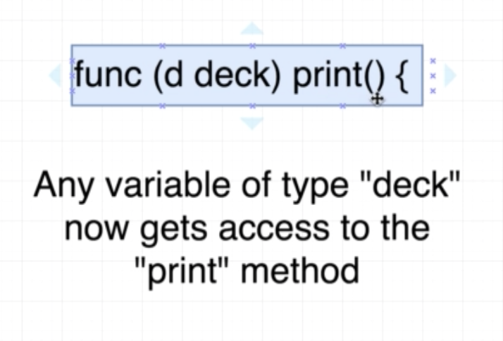
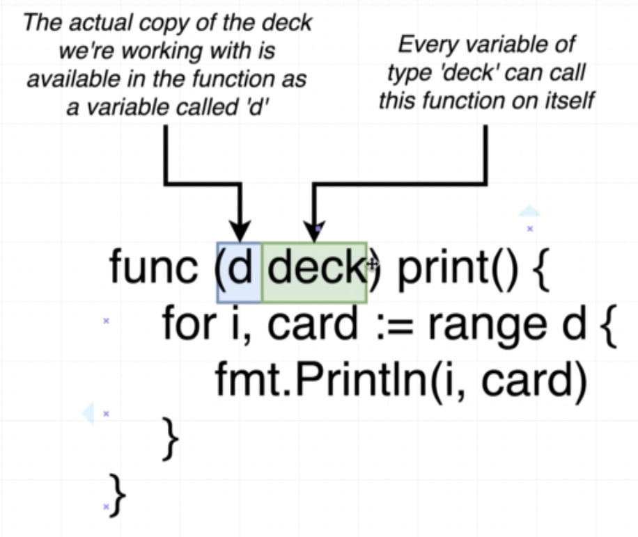

# Card project
## Class - OO Approach  





## Code Structure



## Custom type decarations

```go
type deck []string
```

```
go run main.go deck.go
```

## Receiver Functions

```go
func (d deck) print() {
    ....
}
```





```
Receiver variable == this == self 
```

## Naming convention

Name of receiver variable is 1 or 2 chars.

## Quiz

1. What would the following code print out?

```go
package main
 
import "fmt"
 
type book string
 
func (b book) printTitle() {
    fmt.Println(b)
}
 
func main() {
    var b book = "Harry Potter"
    b.printTitle()
}
```

```
A. Nothing, it would throw an error
B. Nothing, it would print out an empty string
C. "Harry Potter"
```
<!-- C -->

2. What does the variable 'ls' represent

```go
type laptopSize float
 
func (ls laptopSize) getSizeOfLaptop() {
    return ls
}
```

```
A. A value of type 'laptopSize'
B. The type 'laptopSize'
C. A function
```
<!-- A -->

3. Is the following code valid?

```go
type laptopSize float64
 
func (this laptopSize) getSizeOfLaptop() laptopSize {
    return this
}
```

```
A. No, it would fail to compile
B. Yes, and there is nothing wrong with it.
C. Yes, but it is breaking convention, Go avoids any mention of 'this' or 'self'
```
<!-- C -->

4. By creating a new type with a function that has a receiver, we...

```
A. Are adding a 'method' to any value of that type
B. Can call the function with any type we want
```
<!-- A -->