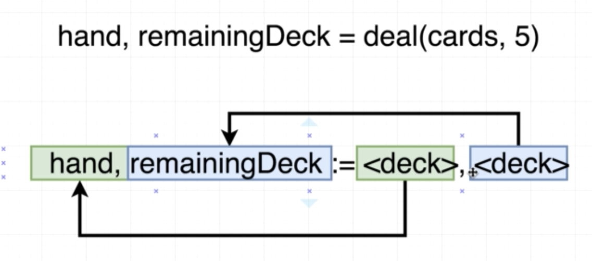

# Card project
## Deal n cards : Multiple Return Values

```
deal(cards, 5) => cards on hand, left cards in deck
```



## Quiz

0. Print all cards on hand and left cards in deck

1. What will the value and type of 'title' and 'pages' be?

```go
func getBookInfo() (string, int) {
    return "War and Peace", 1000
}
 
title, pages := getBookInfo()
```

```
A. Pages will be a string with value "War and Peace".  Title will be an int with value 1000
B. Title will be a string with value "War and Peace".  Pages will be an int with value 1000
C. Both 'title' and 'pages' will not be assigned a value
```

<!-- B -->

2. What will the following program log out?

```go
package main
 
import "fmt"
 
func main() {
    color1, color2, color3 := colors()
 
    fmt.Println(color1, color2, color3)
}
 
func colors() (string, string, string) {
    return "red", "yellow", "blue"
}
```

```
A. Nothing, it will generate an error because only two values can be returned from a function at a time
B. "red" "yellow" "blue"
```

<!-- B -->

3. What will the following program log out?

```go
package main
 
import "fmt"
 
func main() {
   c := color("Red")
 
   fmt.Println(c.describe("is an awesome color"))
}
 
type color string
 
func (c color) describe(description string) (string) {
   return string(c) + " " + description
}
```

```
A. "Red"
B. "Red is an awesome color"
C. Nothing, it will throw an error
```

<!-- B -->

4. Which of the following best explains the `describe`  function listed below?

```go
package main
 
import "fmt"
 
func main() {
   c := color("Red")
 
   fmt.Println(c.describe("is an awesome color"))
}
 
type color string
 
func (c color) describe(description string) (string) {
   return string(c) + " " + description
}
```

```
A. 'describe' is a function that is called with another color and returns a string
B. 'describe' is a function with a receiver of type 'color' that requires an argument of type 'string', then returns a value of type 'string'
C. 'describe' is a function with a receiver of type 'color' that requires an argument of type 'string', then returns a value of type 'color'
```

<!-- B -->

5. After calling "deal" and passing in "cards", does the list of strings that the "cards" variable point at change?  In other words, did we modify the 'cards' slice by calling 'deal'?

```go
func main() {
    cards := newDeck()
 
    hand, remainingCards := deal(cards, 5)
 
    hand.print()
    remainingCards.print()
}
```

```
A. Yes, 'cards' will be different after calling 'deal'
B. No, 'cards' will be the same before and after calling 'deal'
```

<!-- B -->