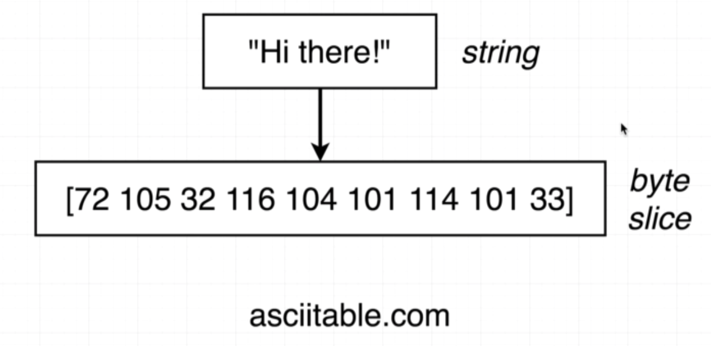
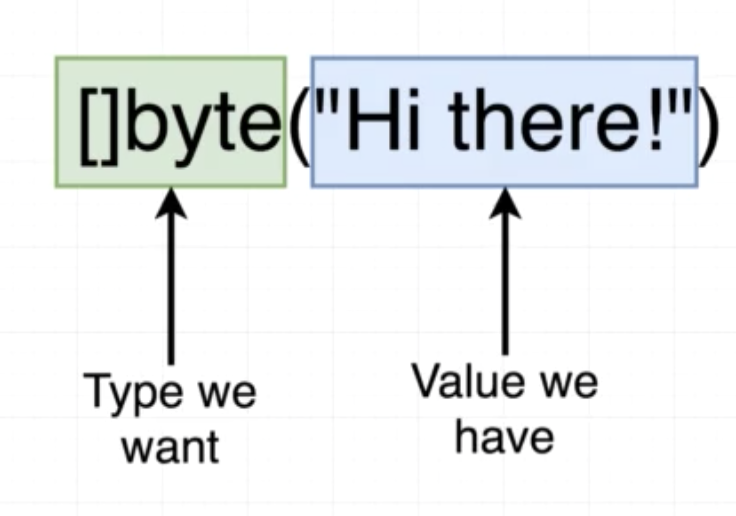
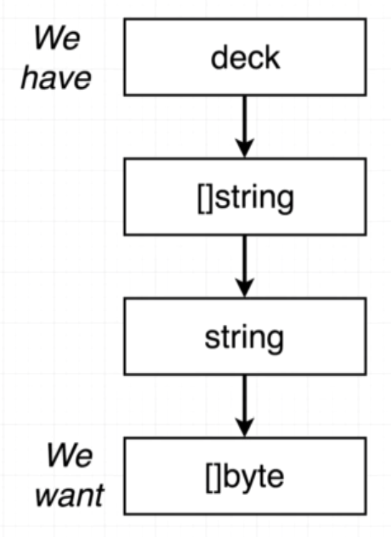

# Card project
## saveToFile

`ioutil` : https://golang.org/pkg/io/ioutil/
`writeFile` : https://golang.org/pkg/io/ioutil/#example_WriteFile

## Byte slices



## Deck to string





## Joing a slice of strings

```
["Yellow", "Red", "Green"] => "Yellow,Red,Green"
```

`strings` : https://golang.org/pkg/strings/
`Join` : https://golang.org/pkg/strings/#Join

```
deck.toString()
```

## Saving Data to the Hard Drive

```
deck.saveToFile("filename.txt")
```
