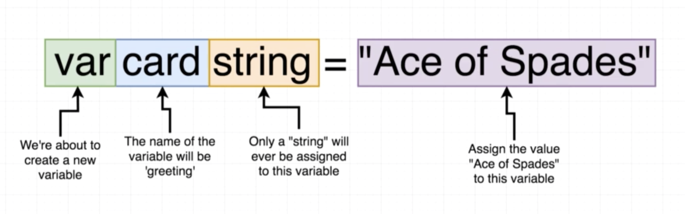
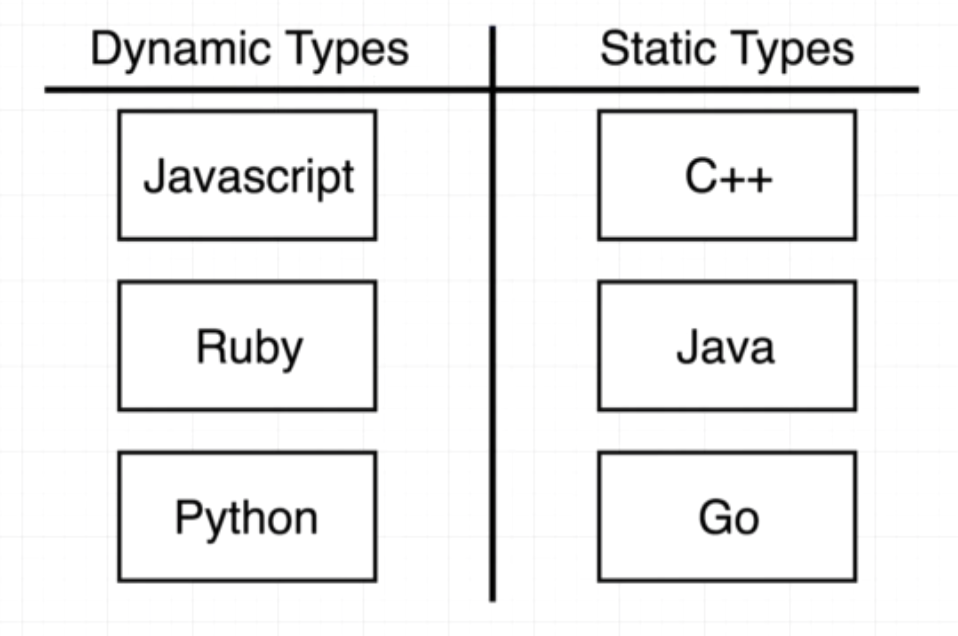
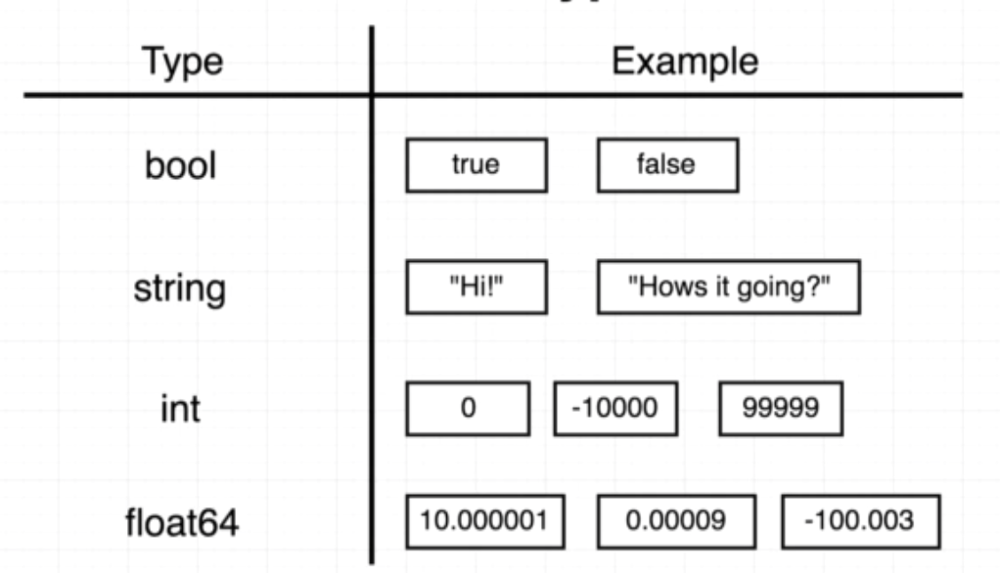

# Card project
##  Project overview


## Variable declarations



### Dynamic vs Static type language



```javascript
var number = 123
number = "test"
```

## Basic go types



## Quiz

1. Is the following a valid way of initializing and assigning a value to a variable?

```go
var bookTitle string = "Harry Potter" 
```

```
A. Yes
B. No
```

<!-- A -->

2. Is the following a valid way of initializing an assigning a value to a variable?

```go
fruitCount := 5 
```

```
A. Yes
B. No
```

<!-- A -->


3. After running the following code, Go will assume that the variable `quizQuestionCount` is of what type?

```go
quizQuestionCount := 10
```

```
A. Float
B. Integer
C. String
D. Map
```

<!-- B -->

4. Will the following code compile?  Why or why not?

```go
paperColor := "Green"
paperColor := "Blue"
```

```
A. Yes, because we are creating and assigning a value to the variable 'paperColor' twice.
B. No, because a variable can only be initialized one time.  In this case, the ':=' operator is being used to initialize 'paperColor' two times
C. No, because ':=' is not a valid operator
```

<!-- B -->

5. Are the two lines following ways of initializing the variable 'pi' equivalent?

```go
pi := 3.14 
```

```go
var pi float = 3.14
```

```
A. Yes
B. No
```

<!-- A -->

6. Is the following code valid?

```go
package main
 
import "fmt"
 
deckSize := 20
 
func main() {
  fmt.Println(deckSize)
}
```

```
A. Yes
B. No
```

<!-- B -->

7. Is the following code valid?

```go
package main
 
import "fmt"
 
func main() {
  var deckSize int
  deckSize = 52
  fmt.Println(deckSize)
}
```

```
A. Yes
B. No
```

<!-- A -->

8. Is the following code valid?

```go
package main
 
import "fmt"
 
var deckSize int
 
func main() {
  deckSize = 50
  fmt.Println(deckSize)
}
```

```
A. Yes
B. No
```

<!-- A -->