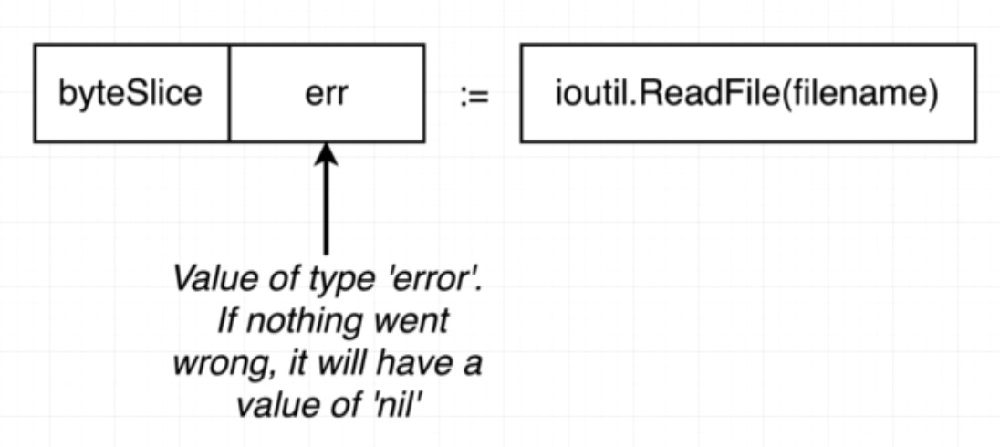
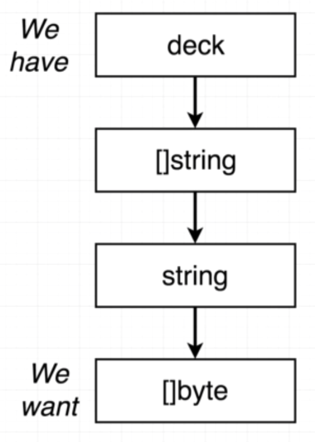

# Card project
## newDeckFromFile

`ioutil` : https://golang.org/pkg/io/ioutil/

`readFile` : https://golang.org/pkg/io/ioutil/#ReadFile

```
newDeckFromFile("deck.txt")
```





## Spliting string into []string

```
"Yellow,Red,Green" => ["Yellow", "Red", "Green"]
```

`strings` : https://golang.org/pkg/strings/
`Split` : https://golang.org/pkg/strings/#Split
