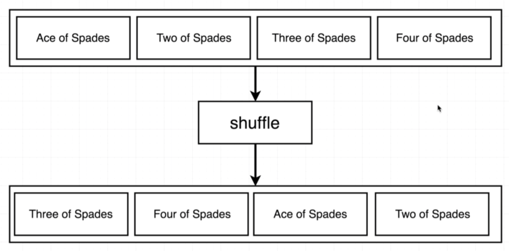
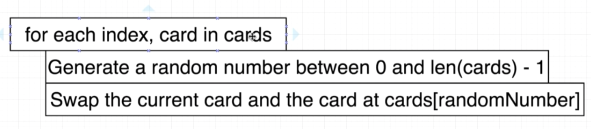
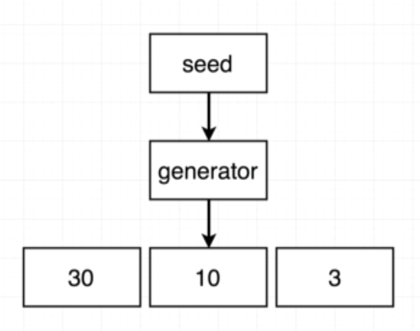

# Card project
## Shuffle logic





## math/rand

https://golang.org/pkg/math/rand/

## Shuffle func

```
deck.shuffle()
```

## Pseudorandom



```
rand.NewSource(int64)
```

https://golang.org/pkg/time/#Now

```
time.Now().UnixNano()
```