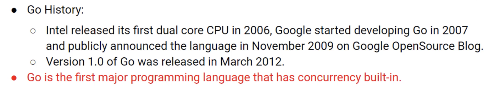

# Go routine / Channel

## Website uptime checker


```go
links := []string{
    "https://google.com",
    "https://facebook.com",
    "https://stackoverflow.com",
    "https://golang.org",
    "https://amazon.com",
}
```

```go
func checkLink(link string) {
	...
}
```

## Synchronous process


## Parallel


## Go routine?


## Go routine syntax


## Theory of go routine


## Concurrency in Go



## Concurrency vs Parallelism


## Run program with go

```
go run main.go
```

## Channel?


## Channel implementation


```
https://golang.org is up :)
is up :)
```

## Blocking channels


```
https://golang.org is up :)
is up :)
https://google.com is up :)
is up :)
```


## Receiving message

```go
for i := 0; i < len(links); i++ {
    fmt.Println(<-c)
}
```


## Repeting routine

```go
for {
    go checkLink(<-c, c)
}
```

```go
for l := range c {
    go checkLink(l, c)
}
```

## Sleeping routine

```go
time.Sleep(5 * time.Second)
```

## Function Literals


```go
for l := range c {
    go func() {
        time.Sleep(5 * time.Second)
        checkLink(l, c)
    }()
}
```

### Output

```
https://google.com is up :)
https://golang.org is up :)
https://stackoverflow.com is up :)
https://facebook.com is up :)
https://amazon.com is up :)
https://amazon.com is up :)
https://amazon.com is up :)
https://amazon.com is up :)
https://amazon.com is up :)
https://amazon.com is up :)
https://amazon.com is up :)
https://amazon.com is up :)
https://amazon.com is up :)
https://amazon.com is up :)
https://amazon.com is up :)
```

```go
go func(l string) {
    time.Sleep(5 * time.Second)
    checkLink(l, c)
}(l)
```

## Quiz

1. Which of the following best describes what a go routine is?

```
A. Code that is ran only when the `go test` command is used
B. A separate line of code execution that can be used to handle blocking code
C. A separate line of code execution that is *only* used for reading files from the operating system
```

<!-- B -->

2. What's the purpose of a channel?

```
A. For communication between different functions in a single program
B. For handling web socket requests
C. For communication between go routines
```

<!-- C -->

3. Are there any issues with it?

```go
package main
 
import (
 "fmt"
)
 
func main() {
 greeting := "Hi There!"
 
 go (func() {
     fmt.Println(greeting) 
 })()
}
```

```
A. There are no issues
B. The `greeting` variable is referenced from directly in the go routine, which might lead to issues if we eventually start to change the value of `greeting`
C. The program will likely exit before the `fmt.Println` function has an opportunity to actually print anything out to the terminal; this might not be the intent of the program.
D. Both answers #2 and #3 are correct
```

<!-- D -->

4. Is there any issue with the following code?

```go
package main
 
func main() {
 c := make(chan string)
 c <- []byte("Hi there!")
}
```

```
A. No issue, looks good! The channel is created to expect a value of type string, but since we pass in a byte slice (which is like a string) we will be OK.
B. The channel is expecting values of type string, but we are passing in a value of type byte slice, which is not technically a string.
```

<!-- B -->

5. Is there any issue with the following code?

```go
package main
 
func main() {
     c := make(chan string)
     c <- "Hi there!"
}
```

```
A. The syntax of this program is OK, but the program will never exit because it will wait for something to receive the value we're passing into the channel.
B. There needs to be a comma between `chan` and `string`
C. Looks good to me!
```

<!-- A -->

5. Ignoring whether or not the program will exit correctly, are the following two code snippets equivalent?

```go
package main
 
import "fmt"
 
func main() {
 c := make(chan string)
 for i := 0; i < 4; i++ {
     go printString("Hello there!", c)
 }
 
 for s := range c {
     fmt.Println(s)
 }
}
 
func printString(s string, c chan string) {
 fmt.Println(s)
 c <- "Done printing." 
}
```

```go
package main
 
import "fmt"
 
func main() {
 c := make(chan string)
 
 for i := 0; i < 4; i++ {
     go printString("Hello there!", c)
 }
 
 for {
     fmt.Println(<- c)
 }
}
 
func printString(s string, c chan string) {
 fmt.Println(s)
 c <- "Done printing." 
}
```

```
A. They are the same
B. They will print out values in different orders
C. #1 has a syntax error, but #2 looks good
D. #2 has a syntax error, but #1 looks good
```

<!-- A -->
