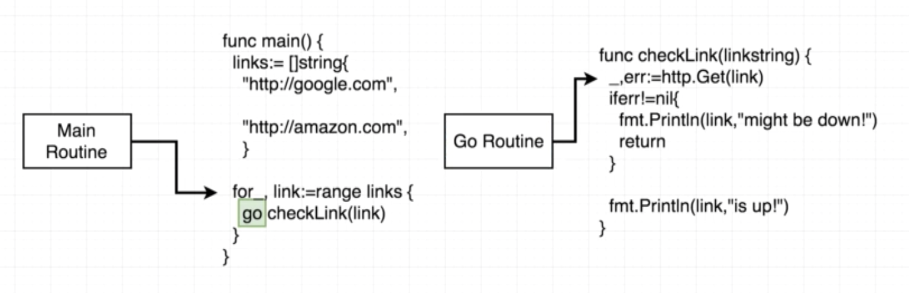

# Go routine / Channel

## Website uptime checker


```go
links := []string{
    "https://google.com",
    "https://facebook.com",
    "https://stackoverflow.com",
    "https://golang.org",
    "https://amazon.com",
}
```

```go
func checkLink(link string) {
	...
}
```

## Synchronous process


## Parallel


## Go routine?




## Go routine syntax


## Theory of go routine


## Concurrency vs Parallelism


## Run program with go

```
go run main.go
```

## Channel?


## Channel implementation


```
https://golang.org is up :)
is up :)
```

## Blocking channels


```
https://golang.org is up :)
is up :)
https://google.com is up :)
is up :)
```


## Receiving message

```go
for i := 0; i < len(links); i++ {
    fmt.Println(<-c)
}
```


## Repeting routine

```go
for {
    go checkLink(<-c, c)
}
```

```go
for l := range c {
    go checkLink(l, c)
}
```

## Sleeping routine

```go
time.Sleep(5 * time.Second)
```