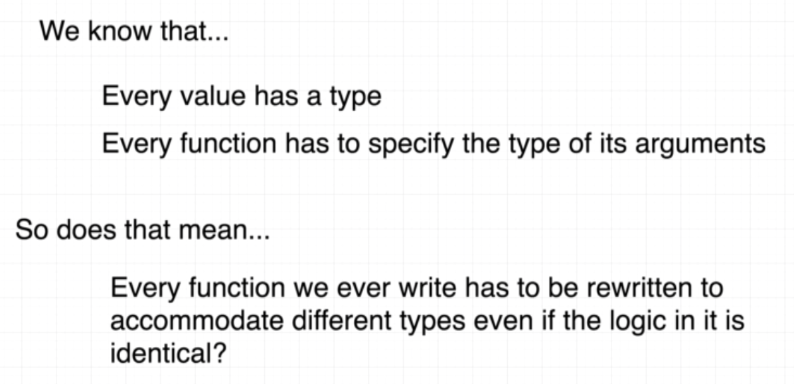

# Interface

## What's interface




## Bot project


```go
package main

type englishBot struct {
}

type spanishBot struct {
}

func main() {

}

func (eb englishBot) getGreeting() string {
	return "Hi There!"
}

func (sb spanishBot) getGreeting() string {
	return "Hola!"
}

func printGreeting(eb englishBot) {
	fmt.Println(eb.getGreeting())
}

func printGreeting(sb spanishBot) {
	fmt.Println(sb.getGreeting())
}
```

```go
type bot interface {
	getGreeting() string
}
```

```go
func printGreeting(b bot) {
    ...
}
```


## Rule of Interface


## Concreate vs Interface


**Concreate** Can create a value by direct to type

**Interface** Can create a value by indirect to type 

## Note for Interface

