# Deep drive into HTTP Package

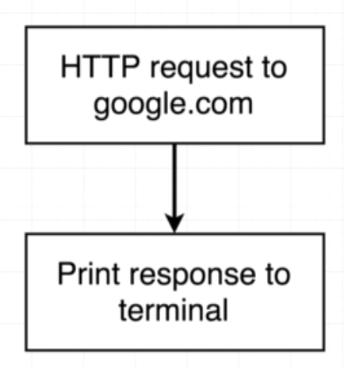

`net/http` : https://golang.org/pkg/net/http/

```go
resp, err := http.Get("https://www.google.com")
```

Read to the doc : https://golang.org/pkg/net/http/#Response

```
Body io.ReadCloser
```

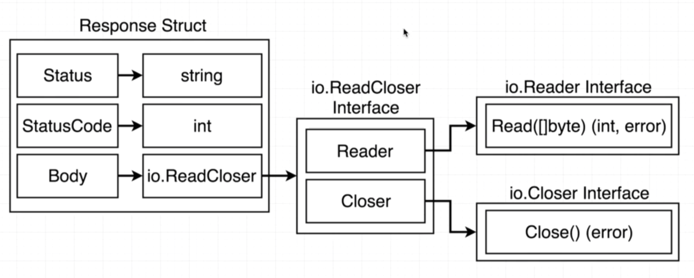

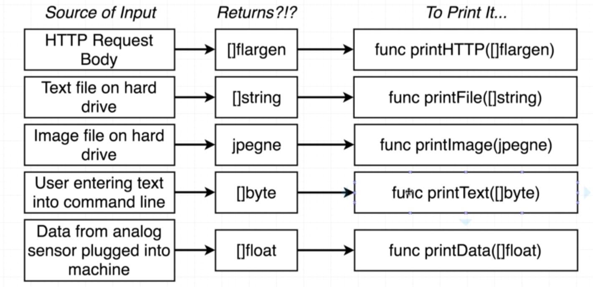

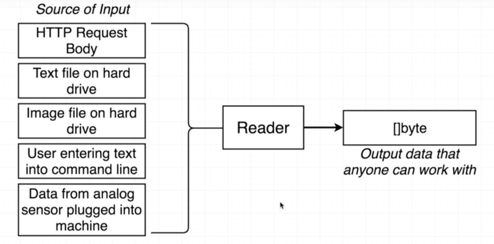

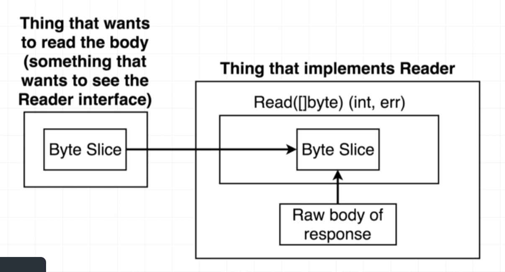

## Create response of reader

```go
bs := make([]byte, 99999)
resp.Body.Read(bs)
fmt.Println(string(bs))
```

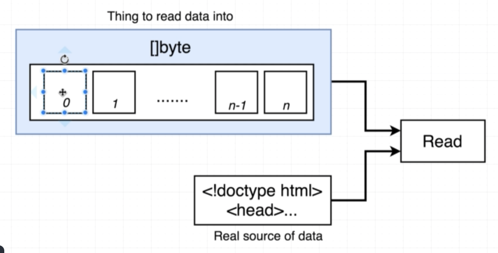

## Easy way to handle 

```go
io.Copy(os.Stdout, resp.Body)
```

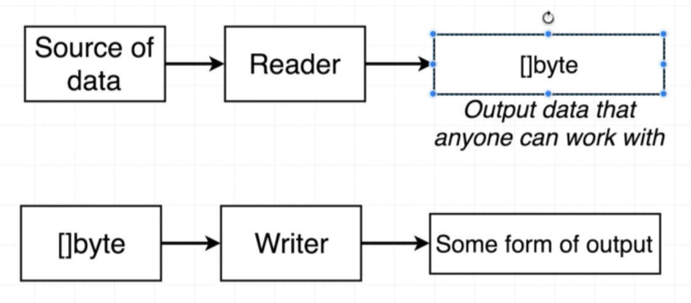

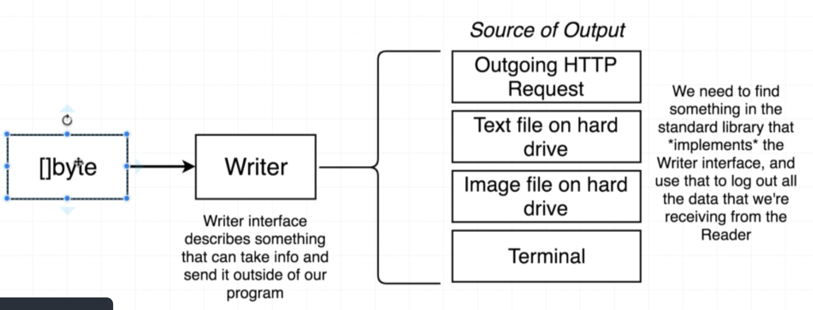

`io.Copy` : https://golang.org/pkg/io/#Copy

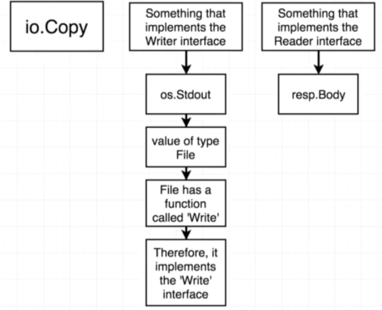

## Implement custom writer interface

```go
type logWriter struct {}
```

```go
func (logWriter) Write(bs []byte) (int, error) {
	...
}
```

## Quiz

1. In the following code, does the `square` type satisfy the `shape` interface?


```go
type shape interface {
    area() int
}
 
type square struct {
    sideLength int
}
 
func (s square) area() int {
    return s.sideLength * s.sideLength
}
 
func printArea(s shape) {
    fmt.Println(s.area())
}
```

```
A. Yes, because `square` defines the `area` function that returns an `int`
B. Yes, because the `printArea` function can be called with anything of type `shape`
C. No
```

<!-- A -->

2. Implement missing code

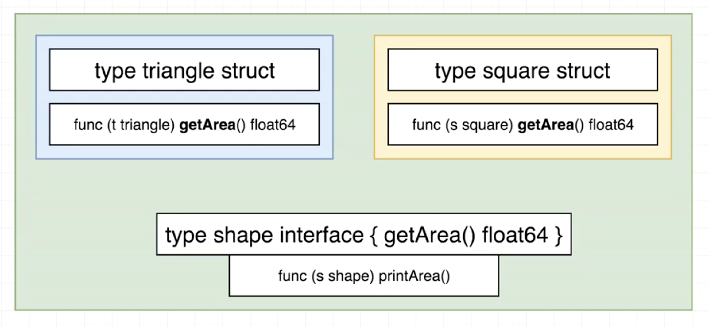

```go
package main

import "fmt"

func main() {
    t := triangle{
        base:   10,
        height: 20,
    }
    printArea(t)
    s := square{
        sideLength: 10,
    }
    printArea(s)
}
```

<!--
type triangle struct {
    base   float64
    height float64
}
type square struct {
    sideLength float64
}

type shape interface {
    getArea() float64
}

func printArea(s shape) {
    fmt.Println(s.getArea())
}

func (t triangle) getArea() float64 {
    return t.base * t.height * 0.5
}

func (s square) getArea() float64 {
    return s.sideLength * s.sideLength
}
-->

3. Read and print file content!

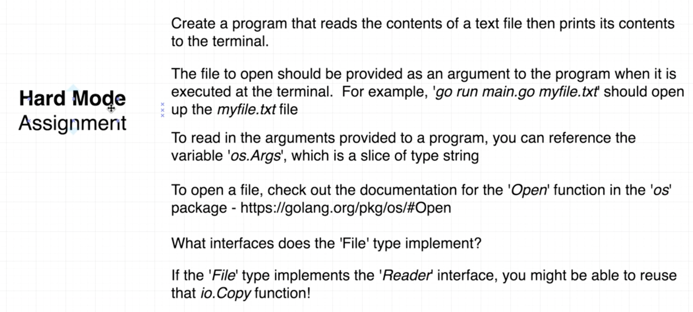

<!--
package main
 
import (
    "fmt"
    "io"
    "os"
)
 
func main() {
    fileName := os.Args[1]
    f, err := os.Open(fileName)
    if err != nil {
        fmt.Println("error:", err)
        os.Exit(1)
    }
    io.Copy(os.Stdout, f)
}
-->