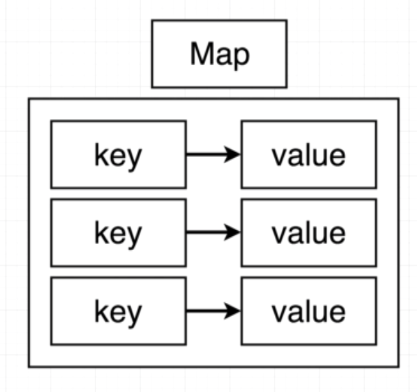
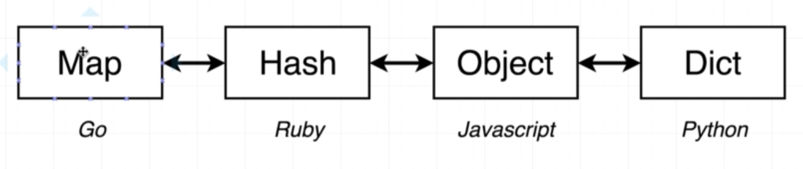
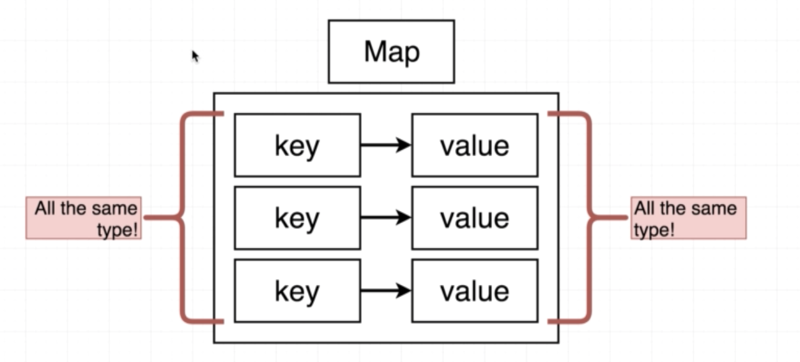
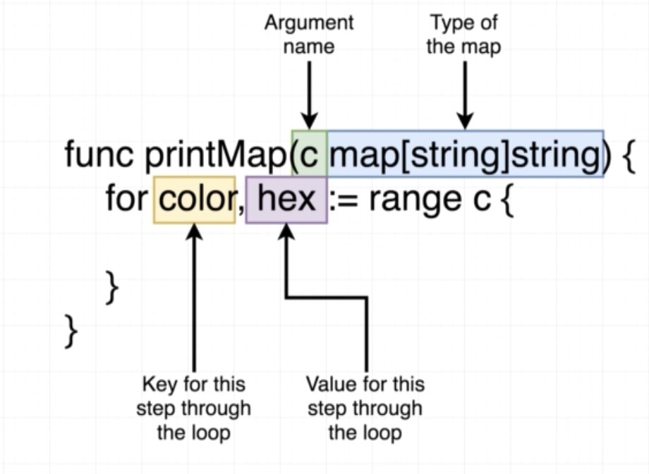
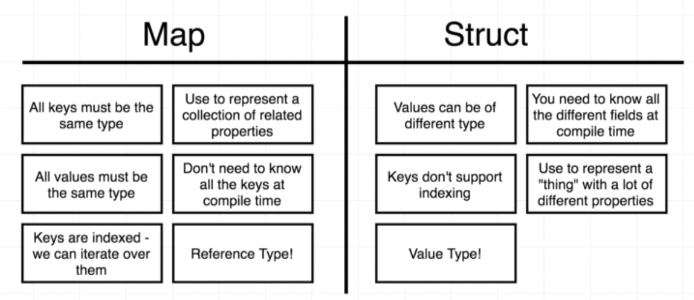

# Map

## Overview of Map







## Define a color map

```go
colors := map[string]string{
    "color name": "hex code of color"
}
```

**Wrong**
```go
var colors map[string]string # create empty value of map
colors["color name"] = "hex code of color"
```

**Correct**
```go
colors := make(map[string]string)
colors["color name"] = "hex code of color"
```

## Struct vs Map value

**Struct** : structName.field

**Map** : mapName[key]

## Delete a key of Map

```go
delete(mapName, keyName)
```

## Loop over the map



## Map vs Struct



```go
func updateMap(colors map[string]string, color string, code string) {
	colors[color] = code
}
```

## Quiz

1. Can some of the keys in a single map be of type `int` and others of type `string` ?

```
A. Yes
B. No
```

<!-- B -->

2. Can some of the values in a single map be of type `int` and others of type `string` ?

```
A. Yes
B. No
```

<!-- B -->

3. What would the print statement log out?

```go
package main
import "fmt"
 
func main() {
 m := map[string]string{
   "dog": "bark",
 }
 
 changeMap(m)
 
 fmt.Println(m)
}
 
func changeMap(m map[string]string) {
 m["cat"] = "purr"
}
```

```
A. Only `map[dog: bark]` because Go made a copy of the map when it was passed to the function `changeMap`
B. `map[dog: bark cat: purr]`
```

4. What would happen if we tried to run the following program? 

```go
package main
import "fmt"
 
func main() {
 m := map[string]string{
   "dog": "bark",
   "cat": "purr",
 }
 
 for key, value := range m {
   fmt.Println(value)
 }
}
```

```
A. It would run successfully
B. The compiler would throw an error because there is an extra comma after `"cat": "purr"`
C. The compiler would throw an error because the variable `key` was created but never used.
```