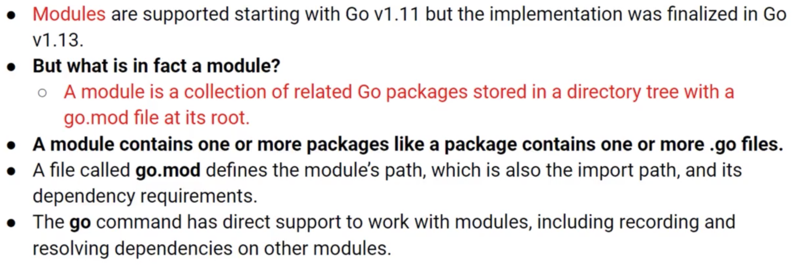

# Module 

## Overview of Go Module



## Importing and using Go Module

```
go mod init hello
```

```
go mod tidy
```

### File structure

```
go.mod
go.sum
main.go
```

### Create your own Go Module

1. Create a repo `iggmath`

2. Create a new file name `main.go`

```go
package iggmath

import "fmt"

func Add(int a, b) int {
	return a + b
}
```

```
go mod init github.com/username/repo
```

