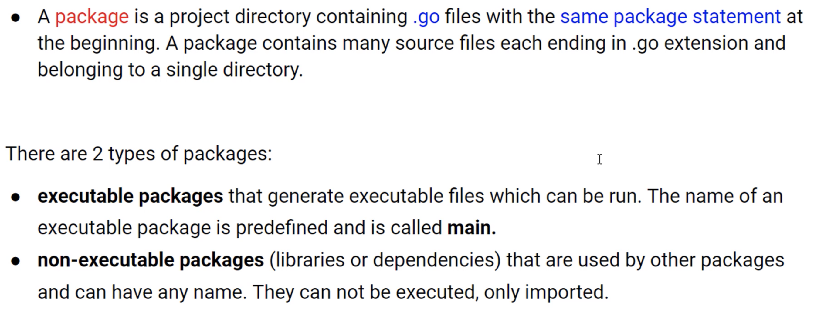
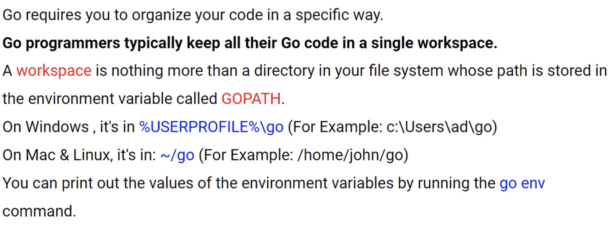

# Package 

## Overview of Package



## GOPATH and Code Organization



```
export GOPATH=/Users/svz/works/golang
go env GOPATH
```

## Package naming

https://blog.golang.org/package-names

## Exporting Names. Private vs. Private Access

Priveate : Lowercase in first letter of function name

Public : Uppercase in first letter of function name
