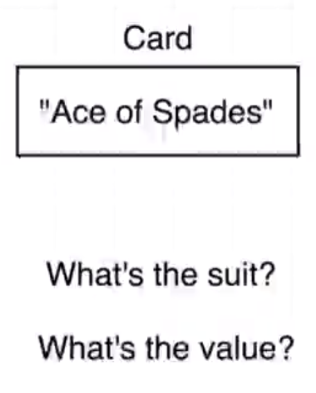
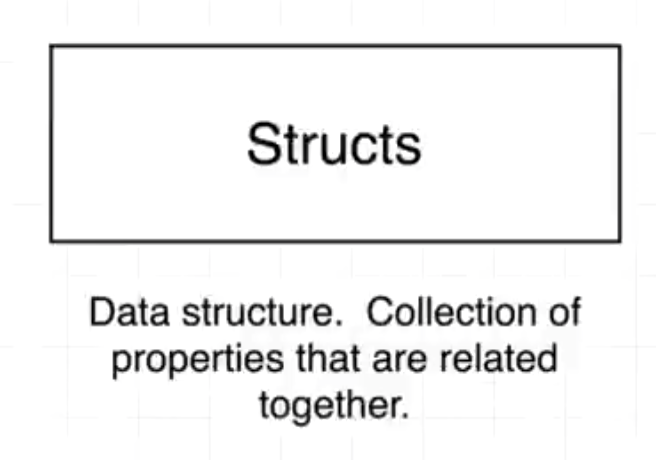
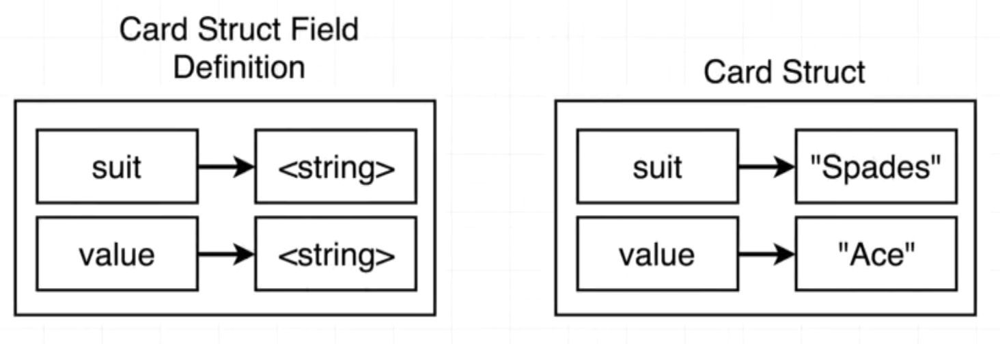
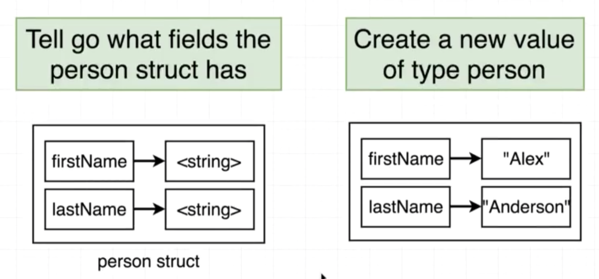
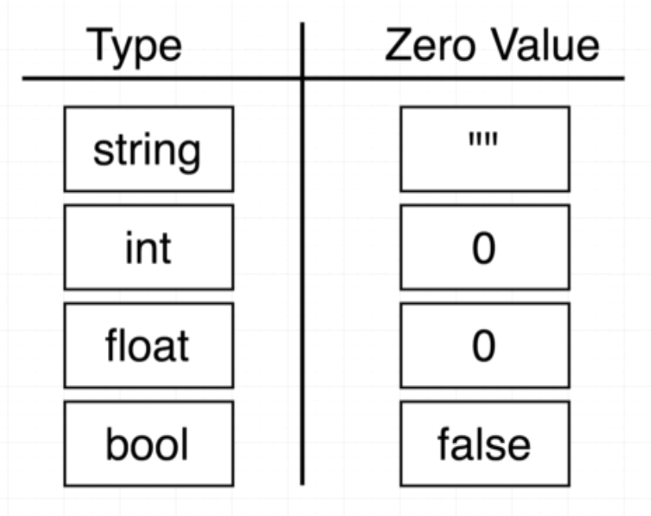
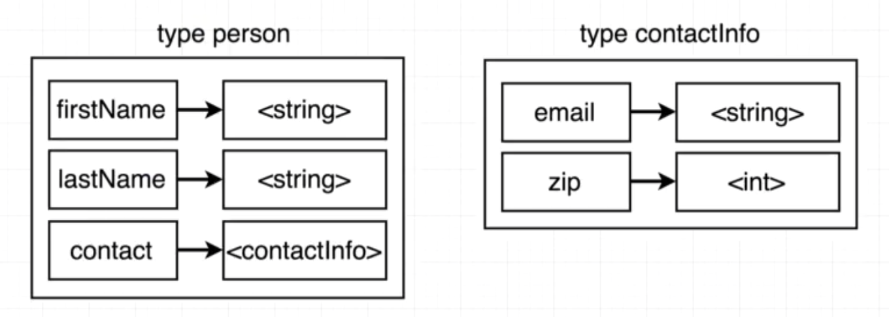

# Struct

## Card project



## Struct?



## Card's struct



## Person's struct



## Let's code

```go
package main

type people struct {
}

func main() {

}
```

## Define people

```go
type person struct {
	firstName string
	lastName  string
}
```

## New person from person struct

```go
taey := person{
	"Nitipat",
	"L",
}
```

```go
taey := person{
    firstName: "Nitipat",
    lastName:  "L",
}
```

```go
var taey person
```



```go
taey.firstName = "Nitipat"
taey.lastName = "L"
```

## Log full struct object

```go
fmt.Printf("%+v", taey)
```

## Struct in Struct



```go
type person struct {
	firstName string
	lastName  string
	contact   contactInfo
}

type contactInfo struct {
	email   string
	zipCode int
}
```

```go
taey := person{
    firstName: "Nitipat",
    lastName:  "L",
    contact: contactInfo{
        email:   "iamsvz@gmail.com",
        zipCode: 50200,
    },
}
```

```go
type person struct {
	firstName string
	lastName  string
    contactInfo
}
```

## Create print function

```
reciever => person
function name => print
output => fmt.Printf("%+v", personObject)
```

## Create updateName function

```
reciever => person
function name => updateName
parameters => new name of person (string)
output => -
```