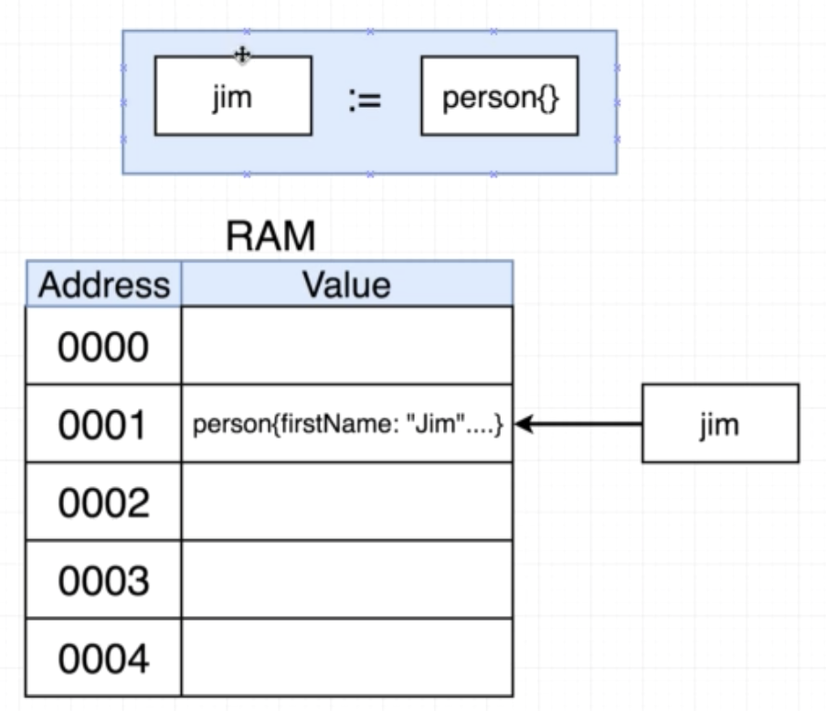
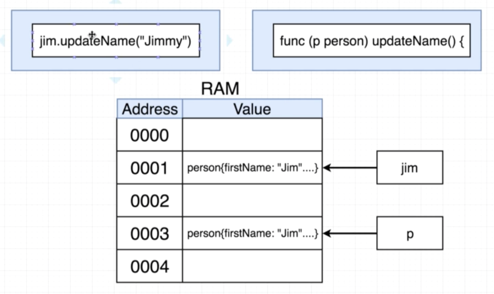
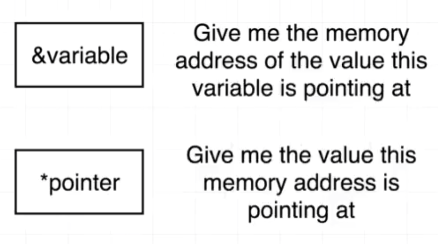
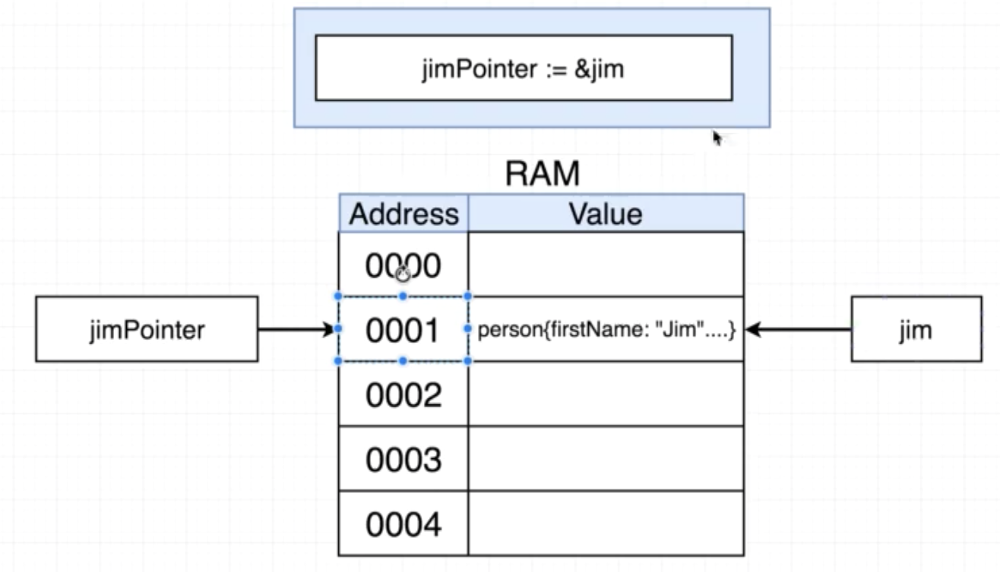
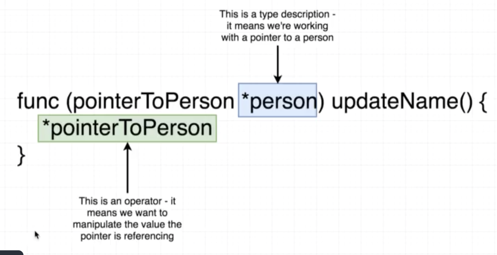
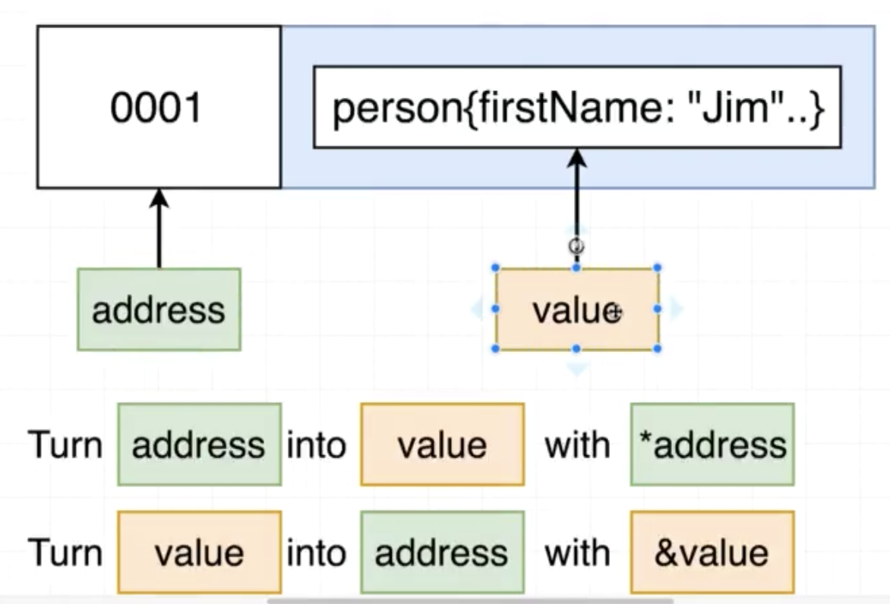

# Struct

## Pass by value





## Pointer

```go
taeyPointer := &taey
taeyPointer.updateName("Nitipat2")
taey.print()
```

```go
func (pointerToPerson *person) updateName(name string) {
	(*pointerToPerson).firstName = name
}
```







## Pointer Summary



## Pointer shortcut

```go
taey.updateName("Nitipat2")
taey.print()
```


## Pointer with Slice

```go
package main

import (
	"fmt"
)

func main() {
	mySlice := []string{"Hi", "there", "how", "are", "you"}
	updateMySlice(mySlice)
	fmt.Println(mySlice)
}

func updateMySlice(slice []string) {
	slice[0] = "Hey"
}
```

## Quiz

1. Whenever you pass an integer, float, string, or struct into a function, what does Go do with that argument?

```
A. It automatically creates a pointer to each argument
B. It sets each argument to its 'zero value'
C. It creates a copy of each argument, and these copies are used inside of the function
```

<!-- C -->

2. What will the following program print out?

```go
package main
import "fmt"
 
func main() {
   name := "Bill"
 
   fmt.Println(&name)
}
```

```
A. The string "Bill"
B. Nil
C. The memory address that "Bill" is stored at
```

<!-- C -->

3. What is the `&` operator used for?

```
A. Joining two strings together
B. Turning a value into a pointer
C. Turning a pointer into a value
```

<!-- B -->

4. When you see a `*` operator in front of a pointer, what will it turn the pointer into?

```
A. A value
B. It will remain a pointer
C. A type definition
```

<!-- A -->

5. When the following program runs, the `fmt.Println` call reports that the `latitude` field of `newYork` is still equal to `40.73` .  What changes should we make to get the `latitude` of `newYork` to update to `41.0` ?

```go
package main
import "fmt"
 
type location struct {
 longitude float64
 latitude float64
}
 
func main() {
 newYork := location{
   latitude: 40.73,
   longitude: -73.93,
 }
 
 newYork.changeLatitude()
 
 fmt.Println(newYork)
}
 
func (lo location) changeLatitude() {
 lo.latitude = 41.0
}
```

```
A. This is not possible with go, we cannot change the original value of a struct in a function
B. The `changeLatitude` function should use `lo["latitude"] = 41.0` to update the struct
C. Change the receiver type of `changeLatitude` to `*location`, then replace `lo` with `(*lo)` in the function body. This will turn the pointer `lo` into a value type and then update it.
```

<!-- C -->

6. What will the following program print out?

```go
package main
 
import "fmt"
 
func main() {
    name := "Bill"
 
    fmt.Println(*&name)
}
```

```
A. The string "Bill"
B. The memory address that "Bill" is stored at
C. The program will throw an error
```

<!-- A -->

7. Take a look at the following snippet of code.

```go
package main
 
import "fmt"
 
type location struct {
 longitude float64
 latitude float64
}
 
func main() {
 newYork := location{
 latitude: 40.73,
 longitude: -73.93,
 }
 
 newYork.changeLatitude()
 
 fmt.Println(newYork)
}
 
func (lo *location) changeLatitude() {
 (*lo).latitude = 41.0
}
```

In the `changeLatitude` function, what is `*location` in the receiver list (after the word `func`) communicating to us?

```
A. It specifies the type of the receiver that the function expects
B. It is trying to turn the `location` type memory address into a value
```

<!-- A -->

7. Take a look at the following program.  What will the `Println` function in the `main` function print out?

```go
package main
 
import "fmt"
 
func main() {
    name := "Bill"
    updateValue(name)
    fmt.Println(name)
}
 
func updateValue(n string) {
    n = "Alex"
}
```

```
A. Bill
B. Alex
C. An empty string
```

<!-- A -->