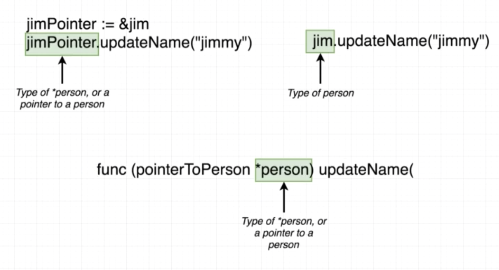

# Struct

## Pass by value


## Pointer

```go
taeyPointer := &taey
taeyPointer.updateName("Nitipat2")
taey.print()
```

```go
func (pointerToPerson *person) updateName(name string) {
	(*pointerToPerson).firstName = name
}
```


## Pointer Summary


## Pointer shortcut

```go
taey.updateName("Nitipat2")
taey.print()
```



## Quiz

1. Whenever you pass an integer, float, string, or struct into a function, what does Go do with that argument?

```
A. It automatically creates a pointer to each argument
B. It sets each argument to its 'zero value'
C. It creates a copy of each argument, and these copies are used inside of the function
```

<!-- C -->

2. What will the following program print out?

```go
package main
import "fmt"
 
func main() {
   name := "Bill"
 
   fmt.Println(&name)
}
```

```
A. The string "Bill"
B. Nil
C. The memory address that "Bill" is stored at
```

<!-- C -->

3. What is the `&` operator used for?

```
A. Joining two strings together
B. Turning a value into a pointer
C. Turning a pointer into a value
```

<!-- B -->

4. When you see a `*` operator in front of a pointer, what will it turn the pointer into?

```
A. A value
B. It will remain a pointer
C. A type definition
```

<!-- A -->

5. When the following program runs, the `fmt.Println` call reports that the `latitude` field of `newYork` is still equal to `40.73` .  What changes should we make to get the `latitude` of `newYork` to update to `41.0` ?

```go
package main
import "fmt"
 
type location struct {
 longitude float64
 latitude float64
}
 
func main() {
 newYork := location{
   latitude: 40.73,
   longitude: -73.93,
 }
 
 newYork.changeLatitude()
 
 fmt.Println(newYork)
}
 
func (lo location) changeLatitude() {
 lo.latitude = 41.0
}
```

```
A. This is not possible with go, we cannot change the original value of a struct in a function
B. The `changeLatitude` function should use `lo["latitude"] = 41.0` to update the struct
C. Change the receiver type of `changeLatitude` to `*location`, then replace `lo` with `(*lo)` in the function body. This will turn the pointer `lo` into a value type and then update it.
```

<!-- C -->

6. What will the following program print out?

```go
package main
 
import "fmt"
 
func main() {
    name := "Bill"
 
    fmt.Println(*&name)
}
```

```
A. The string "Bill"
B. The memory address that "Bill" is stored at
C. The program will throw an error
```

<!-- A -->

7. Take a look at the following snippet of code.

```go
package main
 
import "fmt"
 
type location struct {
 longitude float64
 latitude float64
}
 
func main() {
 newYork := location{
 latitude: 40.73,
 longitude: -73.93,
 }
 
 newYork.changeLatitude()
 
 fmt.Println(newYork)
}
 
func (lo *location) changeLatitude() {
 (*lo).latitude = 41.0
}
```

In the `changeLatitude` function, what is `*location` in the receiver list (after the word `func`) communicating to us?

```
A. It specifies the type of the receiver that the function expects
B. It is trying to turn the `location` type memory address into a value
```

<!-- A -->

7. Take a look at the following program.  What will the `Println` function in the `main` function print out?

```go
package main
 
import "fmt"
 
func main() {
    name := "Bill"
    updateValue(name)
    fmt.Println(name)
}
 
func updateValue(n string) {
    n = "Alex"
}
```

```
A. Bill
B. Alex
C. An empty string
```

<!-- A -->

## Pointer with Slice

```go
package main

import (
	"fmt"
)

func main() {
	mySlice := []string{"Hi", "there", "how", "are", "you"}
	updateMySlice(mySlice)
	fmt.Println(mySlice)
}

func updateMySlice(slice []string) {
	slice[0] = "Hey"
}
```

## Pointer and Slice

```go
package main

import (
	"fmt"
)

func main() {
	myArray := [6]int{2, 3, 5, 7, 11, 13}
	mySlice := []string{"Hi", "there", "how", "are", "you"}
	updateMySlice(mySlice, myArray)
	fmt.Println(mySlice)
	fmt.Println(myArray)
}

func updateMySlice(slice []string, array [6]int) {
	slice[0] = "Hey"
	array[0] = 1
}
```


## Pointer with Array

```go
package main

import (
	"fmt"
)

func main() {
	myArray := [6]int{2, 3, 5, 7, 11, 13}
	mySlice := []string{"Hi", "there", "how", "are", "you"}
	updateMySlice(mySlice, &myArray)
	fmt.Println(mySlice)
	fmt.Println(myArray)
}

func updateMySlice(slice []string, array *[6]int) {
	slice[0] = "Hey"
	array[0] = 1
}
```

**Not recommended!** : https://www.geeksforgeeks.org/golang-pointer-to-an-array-as-function-argument/

```go
package main

import (
	"fmt"
)

func main() {
	myArray := [6]int{2, 3, 5, 7, 11, 13}
	mySlice := []string{"Hi", "there", "how", "are", "you"}
	updateMySlice(mySlice, myArray[:])
	fmt.Println(mySlice)
	fmt.Println(myArray)
}

func updateMySlice(slice []string, array []int) {
	slice[0] = "Hey"
	array[0] = 1
}
```

## Value vs Reference types


## Quiz

1. When we create a slice, Go will automatically create which two data structures?

```
A. An array and a string
B. An array and a list of pointers
C. An array and a structure that records the length of the slice, the capacity of the slice, and a reference to the underlying array
```

<!-- C -->

2. In the following code snippet, when we pass `mySlice` to the `updateSlice` function, is the `mySlice` value being copied before being passed into the function?

```go
package main
 
import "fmt"
 
func main() {
 mySlice := []string{"Hi", "There", "how", "are", "you?"}
 
 updateSlice(mySlice)
 
 fmt.Println(mySlice)
}
 
func updateSlice(s []string) {
 s[0] = "Bye"
}
```

```
A. Yes
B. No
```

<!-- A -->

3. With 'value types' in Go, do we have to worry about pointers if we want to pass a value to a function and modify the original value inside the function?

```
A. Yes
B. No
```

<!-- A -->

4. Is a slice a 'value type' or a 'reference type'

```
A. Reference type, because a slice contains a reference to the actual underlying list of records
B. Value type
```

<!-- A -->

5. With 'reference types' in Go, do we have to worry about pointers if we want to pass a value to a function and modify the original value inside the function?

```
A. Yes
B. No
```

<!-- B -->

6. Do you think the memory address printed by both `Println` calls will be the same?  Why or why not?

```go
package main
 
import "fmt"
 
func main() {
 name := "bill"
 
 namePointer := &name
 
 fmt.Println(&namePointer)
 printPointer(namePointer)
}
 
func printPointer(namePointer *string) {
 fmt.Println(&namePointer)
}
```

```go
package main

import "fmt"

func main() {

	name := "bill"

	namePointer := &name

	fmt.Printf("name        address: %v, name        value: %v\n", &name, name)
	fmt.Printf("namePointer address: %v, namePointer value: %v\n", &namePointer, namePointer)

	printPointer(namePointer)
}

func printPointer(pointer *string) {
	fmt.Printf("pointer     address: %v, pointer     value: %v\n", &pointer, pointer)
}
```